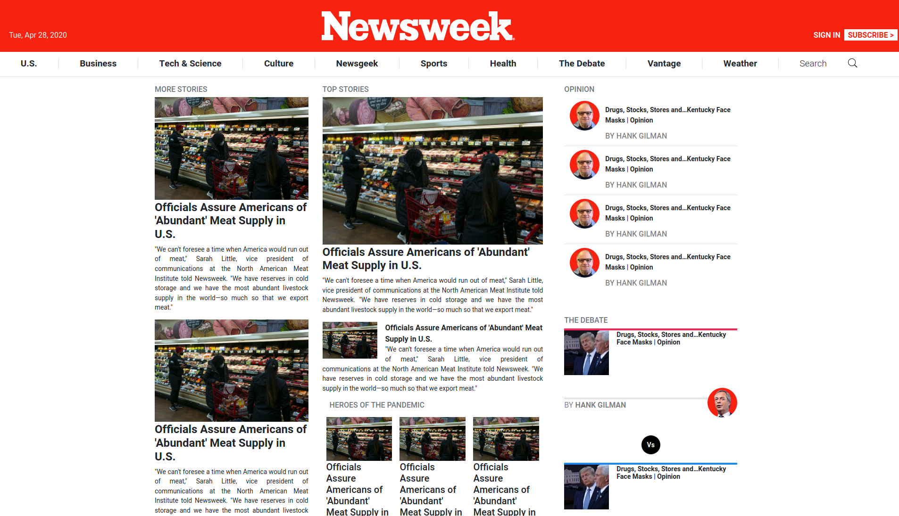

# Using Bootstrap

> In this project, I’ll get a chance to try out Twitter’s Bootstrap framework by building a site that actually uses it – [Newsweek](https://newsweek.com).

This project requests us to build a replica of the news site [Newsweek.com](https://newsweek.com) using the Bootstrap framework.

## Built With

- HTML 5,
- CSS 3,
- Bootstrap

## Live Demo

[Live Demo Link](https://meltrust.github.io/Using-Bootstrap/)

## Getting Started

To get a local copy up and running follow these simple example steps:
 - Clone the project unto your local machine.
 - Navigate into _`index.html`_ file and run on the browser.

## Authors

👤 **Author1**

- Github: [@meltrust](https://github.com/meltrust)
- Linkedin: [meltrust](https://www.linkedin.com/in/meltrust/)
- Contact me: original.mtapia@outlook.com

## 🤝 Contributing

Contributions, issues and feature requests are welcome!

Feel free to check the [issues page](issues/).

## Show your support

Give a ⭐️ if you like this project!

## Acknowledgments

- Hat tip to anyone whose code was used
- Inspiration
- etc

## 📝 License

This project is [MIT](lic.url) licensed.
